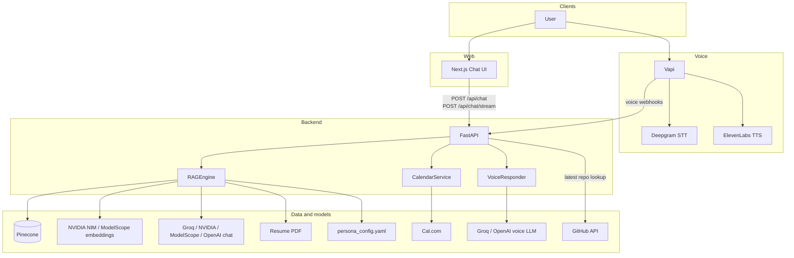
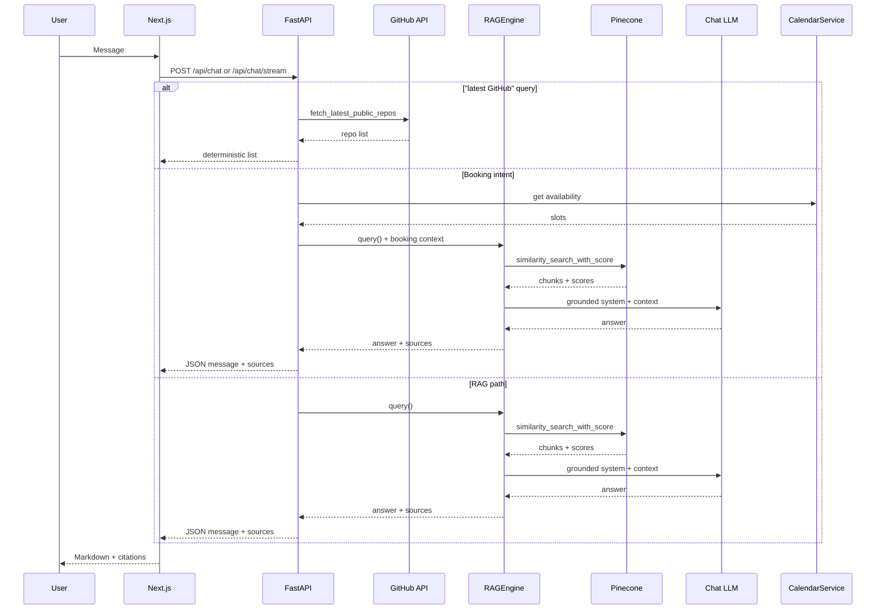
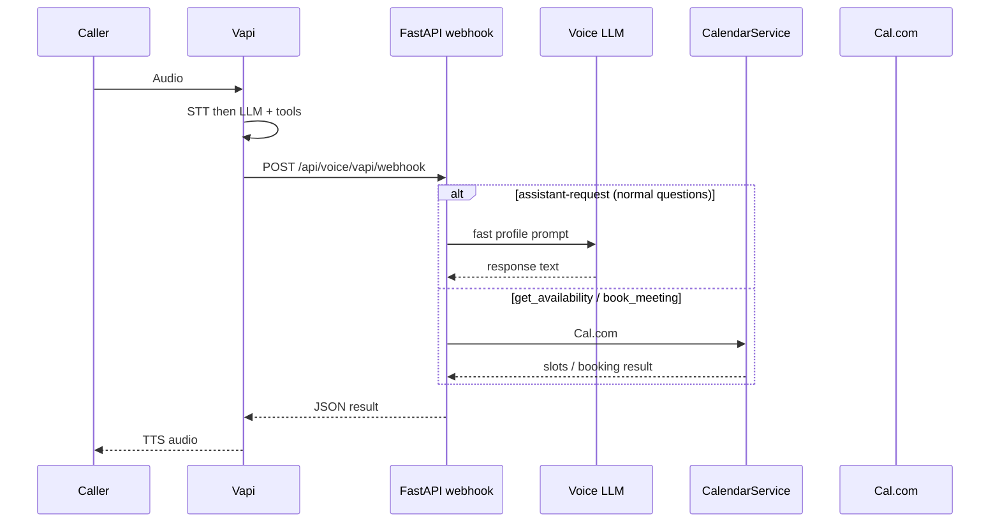

# Architecture

AI Persona is a **retrieval-augmented** assistant over your resume and GitHub, with **real calendar booking**, exposed through **web chat** (Next.js → FastAPI, sync + NDJSON streaming) and **phone voice** (Vapi → FastAPI webhook; fast profile LLM replies plus calendar tools).

**Current deployment (from project env):** frontend on **Vercel**, API on **Railway**, vector store on **Pinecone**, voice on **Vapi**, calendar on **Cal.com**. Chat completion uses a **configurable provider chain** (**Groq / NVIDIA NIM / ModelScope / OpenAI** per `LLM_PROVIDER_ORDER`); embeddings use **NVIDIA NIM** or **ModelScope (OpenAI-compatible)** into a matching Pinecone index. Voice answers use a low-latency LLM (Groq or OpenAI) with an embedded profile, while calendar tools still resolve through Cal.com.

---

## System context (C4-style)



---

## LLM and embeddings (runtime)

| Layer | Typical setup | Notes |
|-------|----------------|-------|
| **Chat LLM** | Ordered chain via `LLM_PROVIDER_ORDER` | Defaults in code include Groq, NVIDIA NIM, ModelScope, OpenAI; timeouts in `LLM_REQUEST_TIMEOUT_SECONDS`. |
| **Voice LLM** | Groq llama-3.1-8b-instant or OpenAI gpt-4o-mini | Used inside `/api/voice/vapi/webhook` for fast profile answers (no Pinecone lookup). |
| **Embeddings** | NVIDIA NIM NeMo 300M when `NVIDIA_EMBEDDING_API_KEY` is set; otherwise ModelScope/OpenAI-compatible | Dimension must match `PINECONE_EMBEDDING_DIMENSION` (2048 for NeMo, 4096 for Qwen, 1536 for text-embedding-3-small). |
| **Fallback embeddings** | OpenAI text-embedding-3-small | Used when NVIDIA embedding key is unset and no custom `EMBEDDING_API_BASE` is configured. |

Re-ingest documents whenever you change embedding provider or dimension.

---

## Persona configuration

Persona settings live in `backend/data/persona_config.yaml` and influence both chat and ingestion:

- **Name/role** surface in prompts and `/api/persona` for the frontend header.
- **resume_file** selects which PDF under `backend/data/` is ingested.
- **background_notes** and **target_role_requirements** are injected into the chat system prompt.
- **github_showcase_repos** and **github_exclude_repos** filter ingestion and boost retrieval ranking.

---

## Chat query lifecycle

**Sequence**



**ASCII overview**

```
User types message
        │
        ▼
Next.js frontend (useChat hook)
        │  POST /api/chat or /api/chat/stream (NDJSON tokens)
        ▼
FastAPI chat route
        │
        ├─ Latest GitHub query? ──YES──► GitHub API → deterministic latest list
        │
        ├─ Detect booking intent? ──YES──► CalendarService → availability context → RAGEngine.query(additional_context)
        │
        ▼ NO
RAGEngine.query()
        │
        ├─ 1. similarity_search_with_score (Pinecone, top-k)
        ├─ 2. Filter by similarity threshold (default 0.70)
        ├─ 3. Optional fallback if nothing passes threshold
        ├─ 4. Format context string from retrieved chunks
        ├─ 5. Build system prompt (grounding prompt + context + history)
        └─ 6. LLM completion (provider chain) → answer
        │
        ▼
ChatResponse (message + sources + booking_link + available_slots + timezone)
        │
        ▼
MessageBubble renders markdown + source citations
```

`/api/chat/stream` returns NDJSON events (`token`, `done`, `error`) for progressive UI updates while reusing the same booking/RAG logic as `/api/chat`.

---

## Voice call lifecycle



**ASCII overview**

```
Phone rings Vapi number
        │
        ▼
Vapi STT (Deepgram nova-2) → transcript
        │
        ▼
LLM reasoning → assistant-request or scheduling tool call
        │
        ▼
Vapi HTTP function-call → POST /api/voice/vapi/webhook
        │
        ├─ assistant-request → Voice LLM (Groq/OpenAI) with embedded profile
        ├─ get_availability  → CalendarService.get_availability()
        └─ book_meeting       → CalendarService.create_booking()
        │
        ▼
Result returned to Vapi as JSON
        │
        ▼
Vapi TTS (ElevenLabs) → audio played to caller
```

---

## Ingestion pipeline

```
persona_config.yaml (resume_file, repo filters)
          │
resume.pdf ──► pypdf extract ──► section splitter + full-text chunking ──► RecursiveCharacterTextSplitter
                                                                          │
GitHub API ──► PyGithub fetch ──► README + metadata + portfolio summary ──┤
                                   format_repo_for_embedding             │
                                                                          ▼
                                                       Embedding API (NVIDIA NIM or ModelScope / OpenAI-compatible)
                                                                          │
                                                                          ▼
                                                       Pinecone serverless index
                                                       (cosine similarity; dimension matches embedding model, e.g. 2048)
```

Operational refreshes run locally via `make ingest` or in production via `POST /api/ingest/github` and `POST /api/ingest/all`.

---

## Infrastructure

| Component | Service | Notes |
|-----------|---------|-------|
| Backend API | Railway | e.g. `BACKEND_URL` in `.env` |
| Frontend | Vercel | e.g. `FRONTEND_URL` / `CHAT_URL` |
| Vector DB | Pinecone (serverless) | Index name + dimension must match embeddings |
| Voice | Vapi | SIP, STT, TTS; `BACKEND_URL` for webhooks |
| Calendar | Cal.com | API + `EVENT_TYPE_ID` |
| Embeddings | NVIDIA NIM (NeMo 300M) or ModelScope / other | See `backend/app/config.py` |
| Chat LLM | Groq / NVIDIA / ModelScope / OpenAI (chain) | `LLM_PROVIDER_ORDER` |
| Voice LLM | Groq / OpenAI | Used in `/api/voice/vapi/webhook` for fast profile replies |
| TTS | ElevenLabs | Per Vapi config |
| STT | Deepgram nova-2 | Bundled via Vapi |

---

## Chunking strategy

- **Chunk size:** 512 characters
- **Overlap:** 50 characters
- **Splitter:** `RecursiveCharacterTextSplitter` (`\n\n → \n → . → " "`)
- **Resume:** split by section first (experience, education, etc.) plus a full-text chunk, then character-level within each segment
- **GitHub:** one document per repo (README + metadata) plus a portfolio summary doc, then character-level split (filters via `persona_config`)

---

## Similarity threshold and retrieval behavior

Retrieval uses cosine similarity scores from Pinecone. Chunks below `similarity_threshold` (default **0.70**) are filtered; if nothing passes, the pipeline can fall back to the strongest available matches so the model still receives context. GitHub “showcase” repos from `persona_config` are boosted for project queries, while excluded repos are dropped from context. For recency-focused questions, the system prefers a live GitHub API lookup and otherwise ranks by `pushed_at` metadata.

---

## Related docs

- [API Reference](API.md)
- [Setup](SETUP.md)
- Root [README](../README.md) for stack table and quick start
