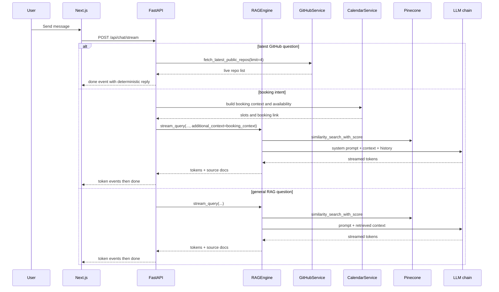
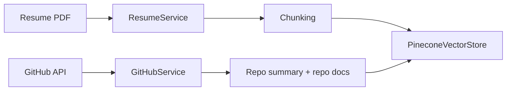

# Architecture

AI Persona is a two-surface assistant for a candidate profile:

- `web chat` for text Q&A, GitHub lookups, and interview scheduling
- `phone voice` for live recruiter calls through Vapi

The backend is a FastAPI service that combines retrieval-augmented generation, live GitHub reads for recency-sensitive questions, and Cal.com booking. The frontend is a Next.js client that streams responses token-by-token and renders bookings inline when the assistant surfaces availability.

This document reflects the current implementation in the repository, including the newer chat streaming path, Cal.com v2 booking flow, persona-config-driven repo ranking, and the tighter voice scheduling rules.

---

## System Overview

```mermaid
flowchart TB
    U[User]

    subgraph FE[Next.js Frontend]
        CHAT[Chat UI]
        HOOKS[Client hooks]
        CALW[Calendar widget]
    end

    subgraph API[FastAPI Backend]
        MAIN[app.main]
        CHATAPI[/api/chat and /api/chat/stream/]
        PERAPI[/api/persona]
        CALAPI[/api/calendar]
        VOAPI[/api/voice/vapi/webhook]
        INGEST[/api/ingest]
        RAG[RAGEngine]
        CAL[CalendarService]
        GS[GitHubService]
    end

    subgraph DATA[Knowledge + external systems]
        PC[(Pinecone)]
        RES[Resume PDF]
        GHA[GitHub API]
        CALCOM[Cal.com v2]
        LLM[Groq / NVIDIA NIM / ModelScope / OpenAI]
        EMB[Embeddings provider]
    end

    U --> CHAT
    CHAT --> HOOKS
    HOOKS -->|POST /api/chat/stream| CHATAPI
    HOOKS -->|fallback POST /api/chat| CHATAPI
    CHAT --> CALW
    CALW -->|POST /api/calendar/book| CALAPI
    U -->|phone| VOAPI

    MAIN --> CHATAPI
    MAIN --> PERAPI
    MAIN --> CALAPI
    MAIN --> VOAPI
    MAIN --> INGEST
    CHATAPI --> RAG
    CHATAPI --> CAL
    CHATAPI --> GS
    VOAPI --> CAL
    VOAPI --> RAG
    RAG --> PC
    RAG --> LLM
    RAG --> EMB
    INGEST --> RES
    INGEST --> GHA
    CAL --> CALCOM
```

---

## Runtime Topology

| Layer | Responsibility | Implementation |
|---|---|---|
| Frontend | Chat UX, streaming token rendering, inline booking controls, persona metadata fetching | Next.js client components and hooks |
| API | Chat, calendar, persona, voice, ingestion, health | FastAPI application created in `app.main` |
| Retrieval | Resume + GitHub RAG over Pinecone | `RAGEngine` plus configurable embeddings and LLM chain |
| Booking | Availability lookup and bookings | `CalendarService` over Cal.com API v2 |
| Voice | Live call orchestration through Vapi | `/api/voice/vapi/webhook` |
| Knowledge ingestion | Parse resume and GitHub repos into the vector store | `run_ingestion.py` |

Deployment is split across Vercel for the frontend and Railway for the backend. The backend container now respects `PORT` at runtime, which makes it compatible with managed hosting platforms that inject the port dynamically.

---

## Backend Bootstrap

The backend starts in [`backend/app/main.py`](/Users/sarthakpandey/persona/backend/app/main.py) using a FastAPI lifespan hook.

Key startup behavior:

- `get_settings()` loads configuration once and caches it with `lru_cache`
- `VectorStoreManager` creates the Pinecone index if it does not already exist
- `RAGEngine` is constructed with the live vector store
- `app.state` stores `settings`, `rag_engine`, and `vector_store_manager` for later request handlers
- CORS is applied with explicit localhost and frontend origins via `build_cors_origins`

The included routers are:

- `GET /health`
- `POST /api/chat`
- `POST /api/chat/stream`
- `GET /api/persona`
- `GET /api/calendar/availability`
- `POST /api/calendar/book`
- `POST /api/voice/vapi/webhook`
- `POST /api/ingest/...`

---

## Frontend Architecture

The frontend is a client-side chat shell that behaves like a terminal console, but the interaction model is still conventional React.

Important pieces:

- [`frontend/src/app/page.tsx`](/Users/sarthakpandey/persona/frontend/src/app/page.tsx) composes the page layout, animated background, header, chat window, and calendar controls
- [`usePersona`](/Users/sarthakpandey/persona/frontend/src/hooks/usePersona.ts) fetches persona metadata with retry backoff
- [`useChat`](/Users/sarthakpandey/persona/frontend/src/hooks/useChat.ts) manages conversation state and streaming lifecycle
- [`useCalendar`](/Users/sarthakpandey/persona/frontend/src/hooks/useCalendar.ts) supports direct calendar operations
- [`ChatWindow`](/Users/sarthakpandey/persona/frontend/src/components/ChatWindow.tsx) renders message bubbles and typing state
- [`MessageBubble`](/Users/sarthakpandey/persona/frontend/src/components/MessageBubble.tsx) renders markdown, sources, and calendar UI
- [`CalendarWidget`](/Users/sarthakpandey/persona/frontend/src/components/CalendarWidget.tsx) lets the user pick a slot and book directly

The chat hook first attempts the streaming endpoint:

1. `POST /api/chat/stream`
2. Parse newline-delimited JSON events
3. Append streamed tokens into the assistant bubble
4. Finalize the message when the `done` event arrives
5. Fall back to `POST /api/chat` if streaming fails or stalls

This means the UI gets low perceived latency without giving up a deterministic fallback path.

The frontend also uses browser timezone detection so booking requests and availability rendering stay localized to the user.

---

## Chat Request Flow



### Request Normalization

The chat endpoint normalizes three things before calling the model:

- Conversation history is passed in from the frontend and capped by the UI to the latest 10 turns
- Timezone is taken from the browser when available
- Booking context is only added when the message looks like a scheduling request

### Live GitHub Short-Circuit

Recency questions such as "latest GitHub projects" bypass the vector store and read live GitHub data directly. That path is limited to the latest 4 public repositories and exists so the assistant does not answer recency questions from stale embeddings.

### Booking Flow Preparation

When the message looks like a booking request, the backend:

- resolves timezone safely
- fetches Cal.com availability for the next 7 days
- formats a human-readable booking context
- includes the direct Cal.com booking link
- returns an early response if the assistant already asked for email and the current message does not include one

The booking flow explicitly asks for name and email before confirming a slot.

---

## RAG Architecture

`RAGEngine` is responsible for retrieval, prompt assembly, and LLM invocation.

### Retrieval Strategy

The retrieval path is intentionally more opinionated than a plain semantic search.

- `similarity_search_with_score` runs in a thread with a timeout so a stalled vector provider does not block the event loop
- `retrieval_top_k` is increased slightly for project-oriented questions
- `similarity_threshold` filters weak matches
- GitHub showcase repositories are boosted when the query sounds like a project or portfolio question
- Recency-oriented GitHub queries bias the search toward the newest pushed showcase repos
- Some GitHub repos can be excluded via `persona_config.yaml` so profile-only or low-signal repos do not dominate the answer

### Prompt Assembly

The system prompt is built from four inputs:

- retrieved documents from Pinecone
- conversation history
- persona background notes
- role requirements and showcase hints from `persona_config.yaml`

The prompt template enforces:

- honesty when the context does not support an answer
- role-specific framing for the AI Engineer target role
- repo selection guidance for GitHub questions
- precise citation of resume facts when they are present

### Output Contract

The response contains:

- generated answer text
- source documents with retrieval scores
- confidence derived from retrieval scores

The frontend uses those source documents to render expandable citations below the assistant message.

---

## LLM Architecture

The chat runtime uses a configurable fallback chain:

1. NVIDIA chat
2. ModelScope chat
3. Groq
4. OpenAI

The exact order is controlled by `LLM_PROVIDER_ORDER`, and the chain automatically skips providers that are on cooldown after rate limits.

Technical details:

- Each provider is wrapped as an OpenAI-compatible `ChatOpenAI` client
- Groq supports multiple API keys and candidate models for rotation
- NVIDIA can reuse the same `nvapi` credential for both chat and embeddings
- Empty generations are rejected so the chain continues to the next provider
- Streaming has a first-token timeout to avoid hanging the UI forever

This design makes the assistant resilient to provider failures without forcing a full deploy-time change when one service is down.

---

## Embeddings and Vector Store

`VectorStoreManager` initializes Pinecone and ensures the index exists before any retrieval or ingestion work starts.

Important implementation details:

- The index is created as serverless on AWS in the configured Pinecone region
- The cosine metric is used for similarity
- The index dimension must match the selected embedding model
- NVIDIA NIM embeddings use a 2048-dimensional model in the current config path
- OpenAI-compatible embeddings and other fallback providers must use a matching dimension

If you switch embedding providers or dimensions, re-ingest the corpus and make sure the Pinecone index is rebuilt with the new dimension.

---

## Ingestion Pipeline



### Resume Ingestion

Resume ingestion uses `resume_path.py` to resolve which PDF to parse.

Resolution order:

1. `resume_file` in `backend/data/persona_config.yaml`
2. `backend/data/resume.pdf`
3. a single PDF file in `backend/data`
4. no resume if multiple PDFs exist and no explicit filename is configured

The resume is parsed with `pypdf`, split into sections, and then chunked with `RecursiveCharacterTextSplitter`.

### GitHub Ingestion

GitHub ingestion uses the GitHub API and ingests:

- repo metadata
- README content
- detected tech stack
- a portfolio summary document

The ingestion path respects two config lists from `persona_config.yaml`:

- `github_showcase_repos`
- `github_exclude_repos`

That allows the assistant to prioritize role-relevant repos and ignore repositories that are technically public but not useful for interview conversations.

### Chunking

The current chunking configuration is:

- chunk size: `512`
- chunk overlap: `50`
- separators: paragraph, newline, sentence, space, empty string

Resume sections are chunked individually, then the full resume text is also chunked to improve recall across different query styles.

### Ingestion Entry Point

`run_ingestion.py` clears the existing Pinecone namespace and then runs resume ingestion followed by GitHub ingestion.

---

## Persona Configuration

`backend/data/persona_config.yaml` is a key piece of the current architecture. It acts as the bridge between raw data and the prompts used by both chat and voice.

It controls:

- persona name and role
- resume filename
- tone and style
- key strengths
- target role requirements
- background notes
- GitHub repo exclusions
- GitHub showcase repos
- timezone defaults

This file is read by `PersonaService`, `resume_path.py`, the RAG prompt template, and the GitHub ingestion logic. It is the main mechanism for tuning the assistant without changing code.

---

## Data Contracts

| Schema | Purpose | Notes |
|---|---|---|
| `ChatRequest` | Incoming chat message | Includes message text, conversation history, conversation ID, timezone |
| `ChatResponse` | Assistant reply | Includes message, sources, booking link, available slots, timezone |
| `AvailabilityResponse` | Calendar slots for UI | Used by direct booking widget |
| `BookingRequest` | Booking payload | Requires name, email, and start time |
| `BookingResponse` | Booking result | Includes success flag, booking ID, and confirmation message |
| `PersonaResponse` | Safe public persona metadata | Used by the frontend header and feature gating |

The frontend and backend share these models conceptually, but the backend uses Pydantic while the frontend uses TypeScript interfaces.

---

## Calendar Architecture

`CalendarService` wraps Cal.com API v2.

### Availability

- Requests the next 7 days of availability
- Normalizes the requested timezone to a valid IANA zone
- Filters out slots that are already in the past
- Formats labels for UI display and voice output

### Booking

- Uses Cal.com v2 booking creation
- Sends attendee name, email, timezone, and notes
- Returns the booking payload and logs the booking ID when available

### API Versions

The service explicitly sets Cal.com version headers because the implementation targets v2 endpoints and the API versions are pinned in code.

### Fallback Behavior

If availability cannot be fetched, the assistant still provides the direct booking link. If a booking request fails, the UI and voice flow both preserve a manual Cal.com fallback path.

---

## Voice Architecture

The voice experience is intentionally more constrained than web chat.

### Assistant Configuration

The Vapi assistant request returns:

- provider: OpenAI
- model: `gpt-4o-mini`
- temperature: `0.3`
- system prompt tailored for voice
- first message that introduces RORI
- two exposed functions: `get_availability` and `book_meeting`

The live assistant does not advertise background or GitHub functions. Those handlers still exist for compatibility and webhook flexibility, but the assistant itself is intentionally narrowed to scheduling tools only.

### Voice Prompt Rules

The system prompt enforces:

- 2 to 3 sentence answers
- direct answers for background and project questions without tool calls
- tool calls only for calendar actions
- no identity repetition unless asked
- no invented links, reminders, or confirmations
- exact slot confirmation before booking

### Webhook Handlers

The Vapi webhook supports multiple payload shapes:

- modern `tool-calls`
- legacy `function-call`
- assistant bootstrap requests
- end-of-call reports
- status updates

### Voice Tool Execution

Tool execution has three safety layers:

- dedupe by function name and argument payload
- in-flight coalescing for concurrent duplicate deliveries
- a short-lived result cache to avoid double bookings

Availability and booking are both guarded by strict timeouts so the webhook stays well under Vapi's timeout window.

### Slot Selection Logic

Booking is not allowed on vague confirmations when multiple slots exist. The webhook will:

- parse exact timestamps
- parse ordinal references like "the second one"
- parse phrases like "tomorrow after 3 PM"
- fall back to a shortlist of exact options when the request is ambiguous

This is the biggest behavioral difference from the earlier voice implementation: the current version is much stricter about only booking a single, explicitly selected slot.

---

## Request Lifecycles

### Chat Lifecycle

1. User sends a message from the frontend
2. Frontend posts to `/api/chat/stream`
3. Backend detects live GitHub recency queries first
4. Backend prepares booking context if needed
5. `RAGEngine` retrieves documents and builds the prompt
6. LLM returns streamed output
7. Frontend renders tokens incrementally
8. Final response includes sources and any booking metadata

### Voice Lifecycle

1. Caller reaches the Vapi number
2. Vapi requests the assistant configuration
3. Vapi selects the live model and system prompt
4. User speech is transcribed by Vapi's upstream stack
5. The model calls either `get_availability` or `book_meeting` if needed
6. Vapi delivers the tool call to the backend webhook
7. Backend returns the result as JSON for the tool call
8. Vapi speaks the final result back to the caller

### Ingestion Lifecycle

1. Read `persona_config.yaml`
2. Resolve the resume PDF
3. Parse and chunk the resume
4. Fetch and normalize GitHub repos
5. Build summary and repo documents
6. Write everything into Pinecone

---

## Operational Safeguards

The current codebase includes a number of guardrails that are worth calling out because they shape behavior under failure:

- LLM provider fallback prevents a single vendor outage from breaking chat
- Retrieval and streaming both use timeouts
- Voice tool calls are deduplicated and cached to avoid duplicate bookings
- Calendar booking requires an exact slot selection when multiple slots are present
- Booking responses preserve a manual Cal.com fallback
- The frontend retries persona metadata before showing the UI as degraded
- Error messages are safer in production than in development
- CORS is locked to known local and production origins rather than wide-open `*`

---

## Configuration Surface

The most important runtime settings are:

- `PINECONE_API_KEY`
- `PINECONE_INDEX_NAME`
- `PINECONE_EMBEDDING_DIMENSION`
- `GITHUB_TOKEN`
- `GITHUB_USERNAME`
- `CALCOM_API_KEY`
- `CALCOM_EVENT_TYPE_ID`
- `CALCOM_USERNAME`
- `BACKEND_URL`
- `FRONTEND_URL`
- `LLM_PROVIDER_ORDER`
- `NVIDIA_EMBEDDING_API_KEY`
- `GROQ_API_KEY`
- `OPENAI_API_KEY`
- `VAPI_API_KEY`
- `VAPI_ASSISTANT_ID`
- `VAPI_PHONE_NUMBER_ID`

The configuration validator in `backend/app/config.py` enforces that at least one usable chat LLM and one usable embedding path are available before startup completes.

---

## Extension Points

If you extend the system, the main seams are:

- `persona_config.yaml` for persona and repo selection tuning
- `prompt_templates.py` for response policy changes
- `llm.py` for provider order and fallback behavior
- `calendar_service.py` for booking provider changes
- `voice.py` for tool-call behavior and scheduling heuristics
- `ingestion/*.py` for adding new knowledge sources

These boundaries are intentional. They keep prompt policy, retrieval policy, booking policy, and UI behavior separate enough that we can evolve one without accidentally destabilizing the others.

